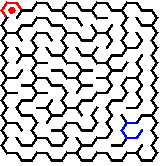
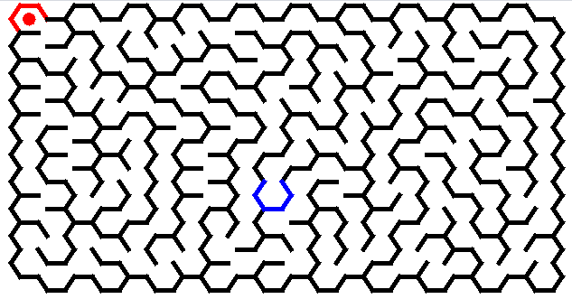
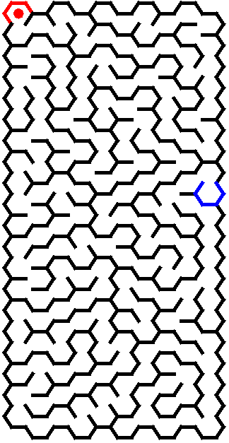
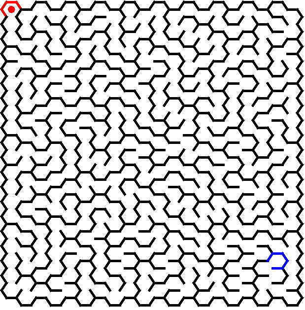
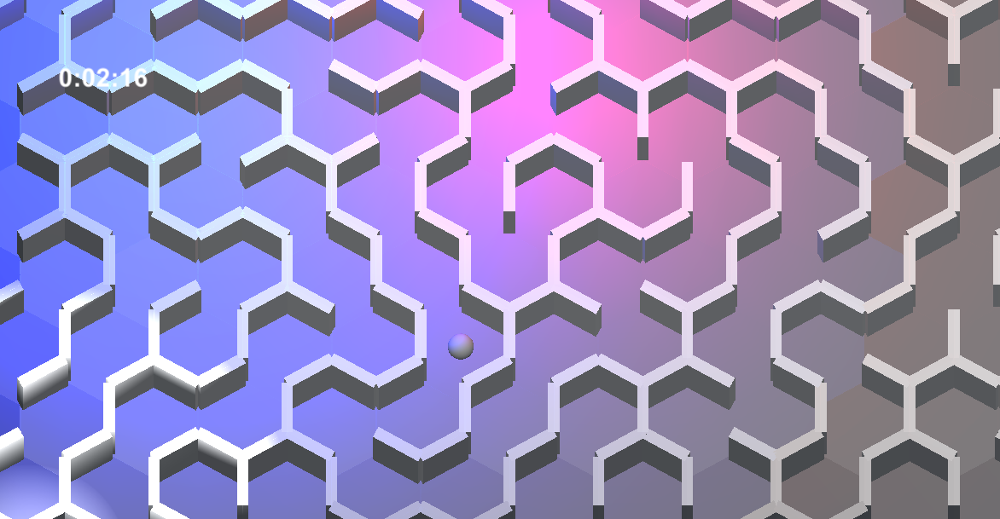

# Hexarinth
Hexagon labyrinth generator made in pure JAVA + Swing, adopted in C# and unity.

Generation is made by Reverse BackTracking 
End point is set by Reverse Djikstra to make correct path as long as possible 
Starting point is RED, ending point is BLUE 
Controlling = Mouse (click/drag) keyboard makes it different because of 6 possible ways or you can print it and solve it by your hand (JAVA version) and ARROWS (Unity/C# version)  
Generation size is limited only in the interface mode, you can change limits in code by yourself.  

Lots of comments for debugging (as always), sorry for that

JAVA .jar directory: JAVA\Hexarinth\dist\testmaze.jar

# Examples:
##     10x10:

##     10x20:

##     20x10:

##     20x20:

Unity 3D (2.5D) / C# version of game is created and will achieve the final form in few weeks/months... and it is going to be uploaded here.
##     Unity version 24x24:

